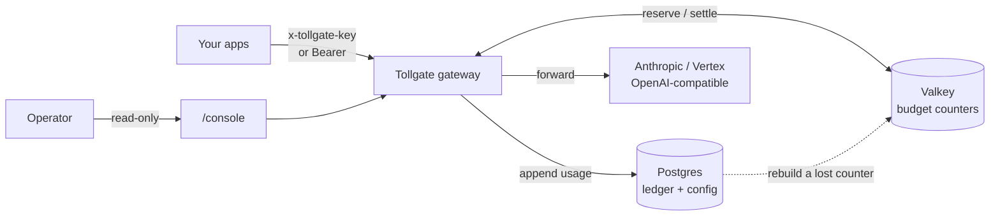
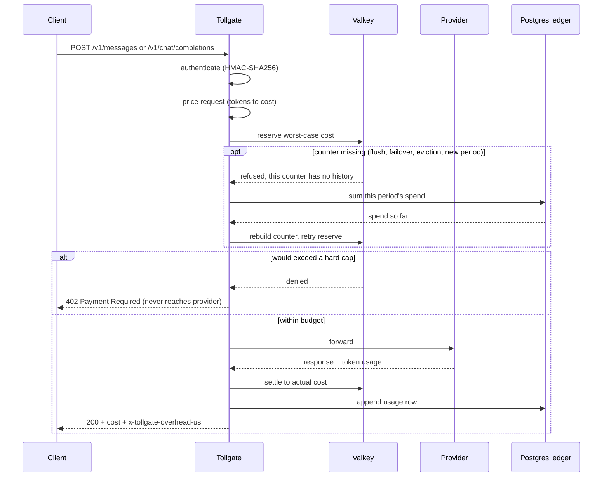

# Tollgate

<picture>
  <source media="(prefers-color-scheme: dark)" srcset="assets/brand/tollgate-logo-dark.svg">
  
</picture>

[](https://github.com/sakura-sky/tollgate/actions/workflows/ci.yml)
[](./LICENSE)
[](https://reuse.software/)

Tollgate is an open-source AI gateway and spend-control proxy. It sits between your applications and their LLM providers (Anthropic, Google Vertex, and any OpenAI-compatible upstream today), prices each request by token, reserves budget before the call, and **refuses any request whose worst-case cost would exceed a budget, before it reaches the model**. Spend is written to a durable, append-only ledger, and a read-only web console shows live budgets, spend, and the gateway's own added latency.

The reservation is the enforcement point, and a request settles to its exact reported cost afterwards. Settlement can land above the reservation in a handful of specific cases, all listed under [Limitations](#limitations); the design's one absolute is that it errs upward, never down.

It draws on the proxy and cost-control patterns popularised by [LiteLLM](https://github.com/BerriAI/litellm), implemented in Rust under MIT.

## Status

Beta, pre-1.0. The budget-enforcement core, provider adapters, web console, config hot-reload, and ledger retention are implemented and tested. The money path uses integer micros throughout with no floating point, reserves before forwarding and settles afterwards, and enforces through atomic Valkey scripts rebuilt from a Postgres ledger. Interfaces and schema may still change before 1.0. Read [Limitations](#limitations) before deploying it: the list is long on purpose, and several entries would change a deployment decision.

See [`CHANGELOG.md`](./CHANGELOG.md) for what each release changed.

## How it works



Each request is authenticated, priced by token, and checked against every budget that applies to it (its key, the provider, the model, and the global backstop) before it is forwarded. The worst-case cost is reserved up front; after the provider responds, the reservation is settled to the exact cost. If any hard cap would be exceeded, the request is refused with `402 Payment Required` before it reaches the provider.



## Use cases

- **Cap AI spend per team, customer, or key** with a real hard stop, not just an after-the-fact alert.
- **A global monthly ceiling** as a backstop across every key in a deployment.
- **One choke point** in front of multiple LLM providers, with an append-only spend ledger.
- **Give finance a live, currency-agnostic view** of token spend by model, key, and provider.
- **Show, don't claim, low overhead**: the console reports Tollgate's own added latency (typically sub-millisecond to low-millisecond) per request.

See [`docs/ARCHITECTURE.md`](./docs/ARCHITECTURE.md) for the components, data model, and enforcement invariants in detail.

## Demo (zero infrastructure)

No Postgres, Redis, or cloud credentials required. Boot an in-memory Tollgate
with a built-in mock LLM provider:

```bash
cargo run -- demo
```

It prints a demo API key and two budgets (a small per-key cap and a global
backstop), then proxies `/v1/mock/...` to the mock. Send requests and watch the
per-key budget meter by token cost and **hard-stop before overspend**:

```bash
curl -s localhost:8080/v1/mock/generate \
  -H "x-tollgate-key: <printed-key>" \
  -H 'content-type: application/json' \
  -d '{"model":"demo","prompt":"hello","max_output_tokens":1000}'
```

The first few requests return `200` with a cost breakdown; once the budget is
exhausted the gateway returns `402` **before the request reaches the provider**.
Inspect spend with the console endpoints (which require the key):
`curl -s -H "x-tollgate-key: <key>" localhost:8080/console/budgets` and
`/console/usage`. The demo binds to loopback only. Or run the whole narrated
sequence at once:

```bash
./scripts/demo.sh
```

### Console (read-only web UI)

The demo also serves a self-contained web console. After `cargo run -- demo`
starts, open the printed URL:

```
http://localhost:8080/console
```

It shows the per-key and global budget meters, live spend, the tokens-to-cost
breakdown, and recent usage, refreshing every second. Click **Send test request**
(or **Auto-send**) and watch the per-key meter climb green to amber to red and
the hard-stop banner appear when the budget is exhausted, while the global
backstop barely moves. In the demo the console is seeded with the demo key so it
connects on load; when the gateway serves it in production the viewer supplies
their own key. The console is deliberately observe-only: it reads the same
key-authenticated JSON endpoints you would call with curl.

### Monitoring

The gateway exposes standard operational endpoints for your SRE stack:

- `GET /healthz` - liveness ping
- `GET /readyz` - readiness
- `GET /metrics` - Prometheus text format. In `serve` this exposes `tollgate_up` only; richer per-decision counters and budget gauges are not in this release. (`demo` mode emits request, cost and budget series as well, so do not size a dashboard on what the demo shows.) Postgres is the system of record for spend, and the console reads it live

Traces export via OTLP when `TOLLGATE_TELEMETRY__OTLP_ENDPOINT` is set.

### Routes

| Route | Method | Auth accepted |
| --- | --- | --- |
| `/v1/messages` | POST | `x-tollgate-key`, `Authorization: Bearer`, or `x-api-key` |
| `/v1/chat/completions` | POST | `x-tollgate-key` or `Authorization: Bearer` |
| `/v1/{provider}/{path}` | POST | `x-tollgate-key` or `Authorization: Bearer` |
| `/console`, `/console/budgets`, `/console/usage` | GET | `x-tollgate-key` or `Authorization: Bearer` |
| `/healthz`, `/readyz`, `/metrics` | GET | none |

Every authenticated route accepts the key either as `x-tollgate-key` or as
`Authorization: Bearer`. `x-api-key` is read on `/v1/messages` only, so the
Anthropic SDK works against it unchanged. Other sub-paths of `/v1/messages/`,
such as `count_tokens` and `batches`, return 404: they are not metered, and
serving them unmetered would put spend outside the ledger.

`GET /console` serves the page itself and needs no key; the viewer supplies one
in the page, and it is `/console/budgets` and `/console/usage` that check it.

Every proxied refusal carries `x-tollgate-reason`, and it means the same thing on
every route: `budget_exceeded` on a `402` (a hard cap would have been breached),
`unpriced` on a `400` (no price is configured for that provider and model, so
Tollgate refuses rather than forwarding something it cannot cost), then
`unauthenticated`, `bad_request`, `backend_error`, `upstream_error`, and
`unsupported` on the `501` for streaming under `exact` admission. Alert on the
header.

`backend_error` means Tollgate's own dependencies, with one exception worth
knowing: under `exact` admission the pre-flight token count is a call to the
provider, and a failure there is reported as `backend_error` rather than
`upstream_error`. If you are diagnosing `exact`-mode failures, check the upstream
as well as Valkey and Postgres.

The response BODY is shaped for whichever client the route serves, so on
`/v1/messages` it is an Anthropic error envelope and its `error.type` uses
Anthropic's vocabulary, which the SDK maps to an exception class. A budget
refusal is therefore `permission_error` in the body and `budget_exceeded` in the
header. Those are the same event described to two different audiences.

## Quick start (local)

Requires Rust 1.85, Docker, and Docker Compose.

```bash
# 1. Bring up Postgres + Valkey
docker compose -f compose/docker-compose.yaml up -d

# 2. Configure. Edit .env and set TOLLGATE_SECURITY__API_KEY_PEPPER to a real
#    secret of at least 16 bytes: the placeholder shipped in .env.example is
#    refused at boot, so leaving it makes step 4 fail.
cp .env.example .env
set -a; source .env; set +a

# 3. Apply migrations
cargo run --bin tollgate -- admin migrate

# 4. Run the gateway
cargo run --bin tollgate -- serve

# 5. Smoke test
curl -s http://localhost:8080/healthz | jq
curl -s http://localhost:8080/readyz  | jq
```

## Managing keys and budgets

Keys and budgets are managed with the `tollgate admin` CLI against your Postgres.
From a source checkout the binary is not on your `PATH`, so either prefix with
`cargo run --` or install it once with `cargo install --path .`. The admin
commands need Postgres running, `TOLLGATE_DATABASE__URL` and a fixed
`TOLLGATE_SECURITY__API_KEY_PEPPER` (at least 16 bytes) set, and migrations
applied:

```bash
docker compose -f compose/docker-compose.yaml up -d
cp .env.example .env            # set TOLLGATE_SECURITY__API_KEY_PEPPER to a real secret
set -a; source .env; set +a
cargo run -- admin migrate
```

Issue a key (the plaintext is shown once and never stored; the command also
prints the key's id, which you need for a per-key budget):

```bash
cargo run -- admin key issue --label "team-alpha"
```

Set a global backstop and a per-key cap (amounts are in your configured currency;
budgets hard-stop by default):

```bash
cargo run -- admin budget set --scope global --period monthly --limit 500
cargo run -- admin budget set --scope api_key:<id> --period monthly --limit 25
```

Scopes are `global`, `api_key:<uuid>`, `provider:<name>`, or
`model:<provider:model>`; periods are `daily`, `weekly`, or `monthly`. Revoke a
key with `admin key revoke --key <key-or-prefix>`. Set model prices (per 1,000,000
tokens) so spend can be costed:

```bash
cargo run -- admin price set --provider anthropic --model claude-sonnet-4-5 \
  --input-per-1m 3 --output-per-1m 15 \
  --cache-read-per-1m 0.30 --cache-write-per-1m 3.75
```

Those figures are illustrative, not a price list. Check them against the
provider's current pricing page before you rely on them: Tollgate ships no
prices and cannot tell you when one changes.

Set the cache rates. A prompt-cache class you leave unpriced is not free: it
falls back to a conservative multiple of the input rate, which over-charges a
cache read by roughly 10x. The model name must match what your client sends,
exactly and case-sensitively, or the request is refused as `unpriced`.

On a re-price, cache rates and the long-context tier CARRY FORWARD unless you
set or clear them, so bumping a base rate does not silently drop them. Clear one
with `--clear-cache-read`, `--clear-cache-write`, or `--clear-long-context`.
`admin price set` prints the tier the model will actually run with; fields it
inherits from the deployment default are marked, and they resolve against the
environment the CLI runs in, so run it with the same `TOLLGATE_BILLING__*`
values as `tollgate serve`.

There is no `admin list` or `admin delete` in this release. To see or remove
budgets and prices, query Postgres directly: `SELECT * FROM budgets;`,
`SELECT * FROM model_prices WHERE effective_to IS NULL;`.

In a running deployment the gateway also serves the read-only web console at
`/console`, along with the key-authenticated JSON it reads: `GET /console/budgets`
(current-period spend and limit per budget) and `GET /console/usage` (the 100
most recent ledger rows, oldest first). Open `/console`, paste an API key, and you get the live budget
meters and usage that the demo shows. These endpoints are observe-only; there are
no write endpoints in the open-source core.

Authorization is deliberately flat: any valid key may view the deployment's
budgets and usage, because Tollgate is single-tenant per deployment (one trust
boundary). Per-tenant scoping, roles, and SSO on these views are planned for the
Tollgate Enterprise edition (see below), not the open-source core.

Every proxied request records the gateway's own added latency. The console shows
the median and p95, and each response carries an `x-tollgate-overhead-us` header.
The figure covers the admission path only: authentication, pricing, and the
reservation. It excludes the upstream provider call, and under `exact` admission
it also excludes the pre-flight token count, which is a full provider round trip
that `exact` adds to every request. So the header is what Tollgate costs you in
`fast` mode, and an understatement of what `exact` costs you.

Budget and price changes apply within the reload interval
(`TOLLGATE_RELOAD__INTERVAL`, default 15s) without restarting the gateway; set it
to `0s` to read config only at startup. A changed limit applies to the existing
spend counter; a brand-new budget starts counting when it is first picked up.

### Admission modes and the hard-stop guarantee

Before forwarding, Tollgate reserves the worst-case cost of a request. Output is
capped by the request's `max_tokens` / `maxOutputTokens`, so the output side is
always bounded. Input tokens are counted one of two ways, set by
`TOLLGATE_PROVIDERS__ADMISSION`:

- `fast` (default): estimate input tokens from the request body. No extra call,
  lowest latency. The estimator counts roughly four ASCII bytes to the token,
  which is about right for prose and too generous for code, JSON, and numeric
  text, where real tokenisation runs closer to two or three characters per
  token. So a reservation can be low by up to roughly the input leg's own size,
  and the request settles above it. The overshoot is bounded by the input-leg
  error times the input rate, per request in flight, not once per cap crossing.
- `exact`: make a pre-flight token-count call to the provider. One extra call per
  request. The input leg is then reserved at the provider's own count, so
  tokenisation drift is eliminated.

Either way the request settles to the provider's reported usage, or to its
reservation when that usage cannot be trusted, and the ledger row says which.
Choose `exact` when you need the input side of the cap to be strict to the token.

`exact` removes tokenisation drift, not every way a settlement can exceed a
reservation. Server-injected tool-use prompt tokens, prompts that name a stored
context cache, long-context re-rating, and untrusted-usage settlements can all
still settle above the reservation. Each is listed under
[Limitations](#limitations). None of them can settle BELOW the true cost, which
is the property the design actually guarantees.

## Limitations

Known limitations in this release, stated up front:

- **Streaming under `exact` admission is refused on the OpenAI path.** A streaming request to `/v1/chat/completions` with `TOLLGATE_PROVIDERS__ADMISSION=exact` returns `501`. The native Anthropic path at `/v1/messages` does support the combination, because `count_tokens` gives it a real pre-flight count for the prompt.
- **Streaming is supported on `/v1/chat/completions` and `/v1/messages` only.** The native Vertex adapter still allows only `:generateContent`, because usage cannot be metered from a partial `streamGenerateContent` response.
- **A stream that does not end cleanly is charged its full reservation**, which over-charges. "Cleanly" means the provider's own terminal event, not merely a closed connection: Anthropic reports a placeholder `output_tokens: 1` in `message_start` and can deliver an error event on an otherwise-healthy 200 stream, so trusting the connection would under-charge a failed stream by its entire output leg. Streams are cut after 60 seconds with no bytes, or 15 minutes in total, and charged their reservation. `/console/usage` splits `measured_cost` from `estimated_cost` over the rows it returns, so this is visible rather than silent.
- **Claude is reached at `/v1/messages`, not `/v1/chat/completions`.** Tollgate does not translate between provider protocols. Point your client's native Anthropic support at it; the Anthropic SDK, LiteLLM and the ADK all speak it. Do **not** configure Anthropic's own OpenAI-compatible endpoint as a custom upstream: it reports no prompt-cache tokens at all, so every cached Claude request would be silently under-counted. Tollgate refuses the obvious form of this at boot, but a CNAME or proxy in front of it cannot be detected.
- **`anthropic-beta` headers are refused unless known to be billing-neutral**, and `service_tier` is pinned to standard. Some betas and tiers change the per-token rate in ways a single configured price cannot express, and an absent tier means "auto", which can use priority capacity at a premium.
- **`max_tokens` defaults to 4096 on the OpenAI path** when a client omits it, or sends it as null or zero, which truncates otherwise-longer answers. There is no response header announcing this, so a client that relies on the upstream's own default will see answers cut short with no signal from Tollgate. The outbound body is normalised to a single `max_tokens` equal to the reserved cap, so what was reserved is what the provider enforces. The native Anthropic path requires `max_tokens`, so no default is applied there.
- **Vertex's OpenAI-compatible endpoint is a Preview surface** under Google's Pre-GA terms, not GA. It is the only *streaming* route to Gemini: the native Vertex adapter serves `:generateContent` only.
- **Prompt-cache classes are priced separately, but only if you price them.** Set them with `admin price set --cache-read-per-1m --cache-write-per-1m`. A class left unpriced is NOT free: it falls back to a conservative multiple of the model's input rate (1x for reads, 2x for writes), because defaulting to zero would silently under-charge every cached request. That fallback deliberately over-charges reads by roughly 10x, since a real cache read costs about a tenth of the input rate, so a 200k-token cached prompt on a $3/1M model bills at roughly $0.06 upstream and records at roughly $0.60 until you set a real rate. The gateway logs a warning naming every model still on fallback rates.
- **Provider context-cache creation and storage are invisible to any proxy.** Google's explicit context caching bills cache *creation* and per-token-hour *storage* against the cache resource, outside the proxied request path, so neither appears in any request's usage block and Tollgate cannot meter or budget them. Requests that *reference* a cache are metered in full, since Gemini reports the cached tokens inside `promptTokenCount`. An agent holding direct `cachedContents` permission can therefore move the creation and storage portion of its spend outside its budget; restrict that permission if the budget needs to be binding.
- **Long-context tiering is opt-in per model, and under-charges until you opt in.** Several current models bill the whole request at a higher rate above roughly 200k prompt tokens, typically 2x on input and 1.5x on output. A price is one rate per class and cannot express that. Set a model's tier with `admin price set --long-context-threshold --long-context-input-permille --long-context-output-permille`, and it applies to the reservation as well as the settlement. The tier lives on the price row, so a gateway fronting one model that tiers and one that bills flat does not have to choose which to get wrong; each field falls back to the deployment default when the row leaves it null. Disable tiering for a single model with `--long-context-threshold 0`, which also drops any multiples that model was carrying; `--clear-long-context` instead returns it to the deployment default. A deployment-wide multiple above 1.0x against a threshold of `0` is refused at boot, because it re-rates nothing and suppresses the under-charge warning too, so it would look configured and do neither. It is **off until set**, because a given model may not tier at all: defaulting to an uplift would invent a charge on a flat-billed model and break the meaning of a rate, since one million tokens would stop costing the per-million rate. Until you set it, a prompt above the threshold is logged as a possible under-charge rather than silently re-rated. The reservation applies the tier slightly below the threshold so that small counting drift cannot flip a request into a multiple it never reserved, and on an upstream whose cache convention is unverified it sizes the prompt at double, because that is what the billing already assumes there. That guard is only as good as the count: under `fast` admission, or where the counted prompt does not cover the whole prompt (a request naming a stored context cache), the reported size can still land far above the reservation and settle at the tier rate. Both cases are the same overshoot the `exact` admission limitation already describes, now multiplied by the tier.
- **Some charges are not modelled at all, and they under-charge.** Per-modality rates (audio input bills several times text on some models); provider server-side tool fees such as web search or code execution, billed per request rather than per token; and grounding fees. Requests that would incur the tool fees are refused rather than mis-billed; modality is not yet detected.
- **`exact` admission is a strict cap only over what the request body reveals.** The reservation is computed from the tokens the request presents. Two classes escape it: server-injected tool-use prompt tokens, and prompts that reference a stored context cache by name, where the body is small but the metered prompt is the full cached size. Both settle correctly and are never under-charged, but they can settle above their reservation and so overshoot a hard cap on the request that crosses it.
- **Observe endpoints are flat-authorized.** Any valid key can view the whole deployment's budgets and usage (single-tenant by design). This concerns only the read-only console and `/console/*` endpoints; budget *enforcement* is still per key. Per-tenant scoping is an Enterprise-edition concern.
- **Minimal metrics.** `/metrics` exposes only `tollgate_up`; Postgres is the system of record for spend and the console reads it live.
- **Some spend is estimated rather than measured, and says so.** When usage cannot be trusted (an upstream that timed out after the request was sent, a response body that will not parse, self-contradictory token counts, a stream that ended abnormally), Tollgate charges the request's reservation rather than releasing it, because the provider may well have served and billed it. Those rows are recorded as `estimated`, and `/console/usage` reports `measured_cost` alongside `estimated_cost`. This deliberately over-charges: releasing instead would under-charge a request the provider is invoicing.
- **Soft budgets count and log, and refuse nothing.** `admin budget set --hard-stop false` records spend against a budget and logs a WARN each time it is exceeded, but never returns a `402`. There is no alerting, no metric, and no console indication beyond the flag itself, so a soft cap is a log line, not a notification. Budgets are hard by default.
- **Postgres is on the request path, and an outage looks like mass key revocation.** Every request does one Postgres lookup to verify its API key, and one insert to append to the ledger. There is no key cache. If Postgres is unreachable, key verification fails and clients receive `401`, not `503`. Reserve and settle normally touch only Valkey, but reserve also reads the ledger whenever a budget counter is absent, which is the first request of every period and any request after a cache loss, and it refuses with `503` if the ledger cannot answer. See the durability section of [`docs/OPERATIONS.md`](./docs/OPERATIONS.md). The ledger insert is best effort: a failure is logged and the request still succeeds, so a sustained Postgres outage means spend that Valkey enforced and the ledger never recorded.
- **Budget periods are UTC.** `daily` resets at UTC midnight, `weekly` on Monday by ISO week, `monthly` on the calendar month. There is no way to align a period to a local day or to a provider's billing cycle, so a budget will not line up with an invoice that runs on a different boundary.
- **A buffered upstream that times out is charged, not released.** `TOLLGATE_PROVIDERS__REQUEST_TIMEOUT` (default 600s) bounds one non-streaming provider call. When it expires the request is recorded as `estimated` at its reservation, because the provider may well have generated a full response Tollgate never read. Setting it low to fail fast therefore over-charges rather than failing cheaply. Any timeout in front of the gateway must be LONGER than this one and longer than the 15-minute stream cap, or the platform cuts the request first, Tollgate never gets to settle it, and the reservation is charged in full. The shipped Terraform sets Cloud Run to 960 seconds for exactly this reason.
- **The console shows settled spend, and enforcement uses a different number.** `/console/budgets` sums the ledger; enforcement reads the Valkey counter, which also holds every reservation currently in flight. The two differ by the in-flight amount, so the console can show headroom while requests are being refused. Each open console polls Postgres once per second, one query per budget.
- **The ledger deletes itself by default.** `TOLLGATE_RETENTION__WINDOW` defaults to 90 days and drops whole partitions past it. If the ledger is your billing record, set it to `0s` or export partitions before they age out.
- **There is no rate limiter.** Tollgate has none, so deploy it behind one. An unauthenticated request still costs a Postgres key lookup, and a key that is over budget writes one rejected row to the ledger per attempt on the buffered paths, which a client in a retry loop will turn into ledger volume. (A streaming request refused for budget returns `402` without a ledger row, so refusals are not uniformly recorded either.)
- **Budgets are corrected upward only.** Startup reconciliation rebuilds counters from the ledger and never lowers them. There is no mechanism to adjust a live budget counter down, deliberately: the same path would be the highest-value thing in the system to compromise, and for output tokens there is no later source of truth to correct against, since they exist only in the response that reported them. Reconciling against a provider invoice is a reporting exercise, not an enforcement one.

## Enterprise edition

The open-source core is single-operator and single-tenant by design: CLI-managed keys and budgets, a read-only console, and one trust boundary per deployment. A Tollgate Enterprise edition with additional capabilities will follow, aimed at teams running Tollgate across many tenants and operators, including web and API management of keys and budgets, role-based access control and SSO, budget-change approval workflows, multi-org scoping, richer analytics, and audit export. If that is of interest, open a [GitHub Discussion](https://github.com/sakura-sky/tollgate/discussions) or contact Sakura Sky. (Please keep the `SECURITY.md` inbox for vulnerability reports only.)

## Configuration

Configuration is layered: built-in defaults → optional `tollgate.toml` → environment variables prefixed `TOLLGATE_`. Nested fields use double underscores (e.g. `TOLLGATE_HTTP__BIND=0.0.0.0:8080`). A name that does not match a field is ignored silently, so check spellings against [`src/config.rs`](./src/config.rs), which is the full schema.

## Deployment (Cloud Run)

The Terraform module under [`infra/terraform/`](./infra/terraform/) provisions the full stack: Cloud SQL Postgres, Memorystore for Valkey (over Private Service Connect), Artifact Registry, a Cloud Run v2 service, and a runtime service account with least-privilege roles for Vertex AI / Gemini, Cloud SQL, Cloud Logging, Trace, and Monitoring. The database URL and API-key pepper are held in Secret Manager and injected by reference, not as plaintext env values.

See [`docs/OPERATIONS.md`](./docs/OPERATIONS.md) for persistence, egress hardening, and reference architectures.

```bash
cd infra/terraform
cp example.tfvars terraform.tfvars   # then edit
terraform init
terraform apply
```

`region` is a required variable with no default. Pick the region closest to your customers and to the Vertex models you intend to call.

## CI

Every pull request, and every push to `main`, a `release/**` branch, or a `v*` tag, runs [`.github/workflows/ci.yml`](./.github/workflows/ci.yml): `cargo fmt --check`, `cargo clippy --all-targets --locked -- -D warnings`, and `cargo test --locked --all-targets` at the 1.85 MSRV, plus a REUSE licence-compliance check and `cargo audit`. No cloud credentials are needed.

CI does not run the Valkey enforcement battery, which needs a live server. Those tests are `#[ignore]`d and are the only coverage of the Lua that actually enforces budgets, so run them by hand before a release: `docker compose -f compose/docker-compose.yaml up -d valkey` then `TOLLGATE_TEST_REDIS_URL=redis://127.0.0.1:6379 cargo test --lib redis_live -- --ignored --test-threads=1`.

Separately, [`cloudbuild.yaml`](./cloudbuild.yaml) runs the same fmt/clippy/test gates and then builds the container image and pushes it to Artifact Registry. Trigger substitutions: `_REGION`, `_AR_REPO`.

## Layout

```
src/
  main.rs         - binary entrypoint
  lib.rs          - module surface
  cli.rs          - clap CLI dispatcher
  config.rs       - layered config (figment)
  telemetry.rs    - tracing + optional OTLP
  app.rs          - axum app, state, graceful shutdown
  db.rs           - Postgres pool + migration runner
  error.rs        - HTTP error type
  pricing.rs      - token → cost engine (integer micros, currency-agnostic)
  apikey.rs       - API-key generation, hashing (HMAC-SHA256), verification
  budget.rs       - budget resolution + reserve-then-settle enforcement
  gateway.rs      - shared request flow (demo and production) + admission modes
  provider.rs     - provider trait + built-in mock
  providers.rs    - Anthropic, Vertex/Gemini, OpenAI-compatible adapters
  backends.rs     - Postgres key/usage stores + Valkey budget backend
  console.rs      - read-only web console (serves assets/console.html)
  demo.rs         - zero-infra demo mode
  routes/
    health.rs     - /healthz, /readyz
assets/           - console.html and brand assets
migrations/       - sqlx migrations
infra/terraform/  - GCP infrastructure module
compose/          - local dev dependencies
docs/             - operations runbook and reference architectures
scripts/demo.sh   - narrated end-to-end demo runner
```

See [`DEVELOPMENT.md`](./DEVELOPMENT.md) for the dev loop.

## Contributing

Contributions are welcome. Please read [`CONTRIBUTING.md`](./CONTRIBUTING.md) before opening a PR, and note the [`CODE_OF_CONDUCT.md`](./CODE_OF_CONDUCT.md). The repo follows the [REUSE](https://reuse.software) convention for licence headers - every source file carries an SPDX header.

## Security

To report a vulnerability, please follow [`SECURITY.md`](./SECURITY.md). Do not open public issues for security problems.

## Licence

[MIT](./LICENSE) © 2026 Andrew Stevens and Tollgate contributors.
