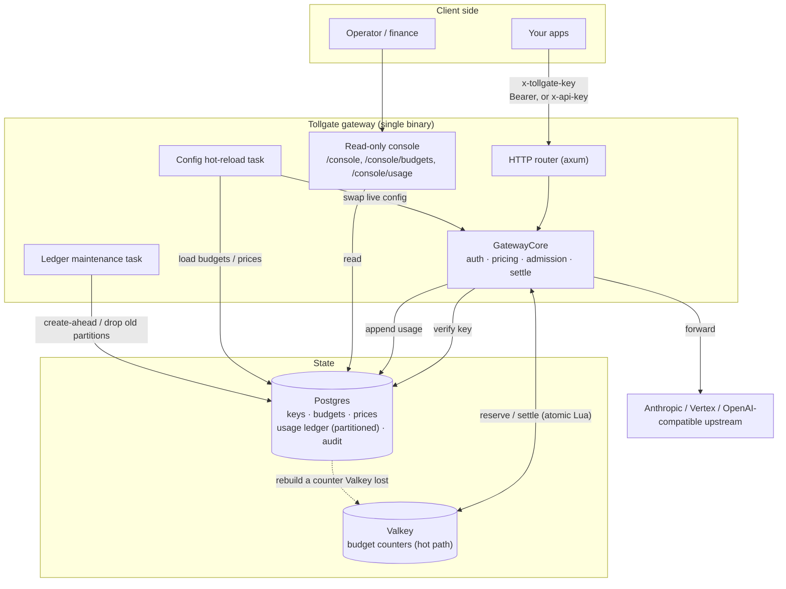
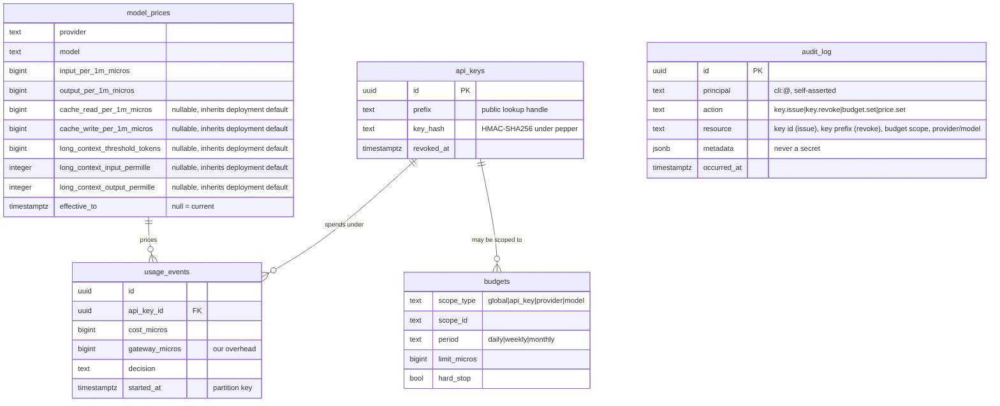

# Architecture

How Tollgate is put together, for operators and contributors. For persistence,
egress hardening, and retention runbooks see [`OPERATIONS.md`](./OPERATIONS.md).

## Components



The whole gateway is one Rust binary. The same request flow (`GatewayCore`) backs
both `tollgate demo` (in-memory) and `tollgate serve` (Postgres + Valkey), so the
demo exercises the real logic.

## Request lifecycle

```mermaid
sequenceDiagram
  participant C as Client
  participant T as Tollgate
  participant DB as Postgres
  participant V as Valkey
  participant P as Provider
  C->>T: POST /v1/messages | /v1/chat/completions | /v1/{provider}/{path}
  T->>T: parse key, HMAC-SHA256 verify (constant time)
  Note over T: unknown provider/model -> 400 (fail closed)
  T->>T: price by token (integer micros)
  Note over T: unpriced model -> record, then 400 (fail closed)
  opt admission = exact
    T->>P: pre-flight count_tokens
    Note over T,P: a failed count is UPSTREAM (502), never a backend error;<br/>a 400/413/422 from it is the caller's body (400)
  end
  T->>V: reserve worst-case cost (atomic check + incr)
  opt counter absent (flush, failover, eviction, new period)
    V-->>T: refused: this counter has no history
    T->>DB: sum this period's spend
    T->>V: rebuild counter (stamped), retry once
  end
  alt would exceed a hard cap
    T->>DB: record decision = rejected_budget
    T-->>C: 402 + x-tollgate-reason: budget_exceeded
  else within budget
    T->>P: forward request
    P-->>T: response + usage
    T->>V: settle reservation to actual cost
    T->>DB: append usage row (cost, tokens, overhead)
    T-->>C: 200 (buffered: + x-tollgate-cost, x-tollgate-overhead-us)
  end
```

Budgets that apply to a request are its API key, the provider, the model, and the
global backstop; every applicable hard cap is checked before the forward. A
request that matches no budget at all is denied, never allowed (fail closed).
That is the only thing enforcement requires: a deployment holding only a per-key
budget serves normally, so the global budget is a strongly recommended backstop
rather than a mandatory one. Its absence is logged at WARN by the config-reload
task, which means it is never reported at all with
`TOLLGATE_RELOAD__INTERVAL=0s`.

## Data model



`usage_events` is append-only (triggers reject UPDATE, DELETE, and TRUNCATE) and
monthly range-partitioned so retention can drop old partitions without violating
immutability. `audit_log` carries the same append-only triggers and records privileged CLI
actions: `key.issue`, `key.revoke`, `budget.set` and `price.set`. Its `principal`
is the OS user and host the command ran as, written literally as
`cli:<user>@<host>`. The `cli:` prefix marks the row as a command line rather
than an identity, so an operator querying for `alice@host` finds nothing without
it. It correlates a change with a shell history rather than authenticating
anybody; see `SECURITY.md`.

## Money and enforcement invariants

- **Integer micros, never floats.** All money is `1e-6` of the deployment's
  configured currency unit; cost math uses `i128` intermediates and rounds once.
- **Reserve then settle.** The worst-case cost is reserved before the forward and
  settled to the provider's reported usage after, so a hard cap cannot be blown by
  an unknown output length. Cost is exact for the input, output and prompt-cache
  token classes, each priced separately, PROVIDED the operator has set a rate for
  each class; an unpriced cache class falls back to a conservative multiple of the
  input rate rather than to zero, which over-charges rather than under-charging.
  Where usage cannot be trusted at all the request is charged its reservation and
  recorded as `estimated` (see the README "Limitations").
- **Atomic enforcement.** The Valkey reserve is a single Lua check-and-increment;
  the settle is a single Lua apply. A cache failure fails closed (503), not a
  budget bypass.
- **Postgres is the system of record.** Valkey counters are a hot-path cache; on
  startup they are reconciled from the ledger, and reconcile only ever raises a
  counter (`max(counter, ledger)`), never lowers it.
- **No fail-open by omission.** A request matching no budget at all is denied. A
  global budget is not required for this: a deployment holding only per-key
  budgets serves normally. It is a strongly recommended backstop, not a
  mandatory one.
- **Auth.** Keys are `tgk_<pub>_<secret>`; only an HMAC of the secret under a
  server-side pepper is stored, compared in constant time, with a dummy-hash
  verify on prefix miss so hit and miss cost the same.

## Storage split

Postgres holds the durable truth: keys, budgets, prices, the usage ledger, and
the audit log. Valkey holds only the current-period spend counters for the hot
path (sub-millisecond reserve/settle), reconciled from Postgres so a cache flush
cannot reset a budget. Retention is by monthly partition drop on the ledger; the
counters expire on their own TTL and are period-scoped, so they are unaffected.

## Configuration reload and retention

Two background tasks keep a running gateway current without restarts: a reload
task swaps budgets and prices in atomically on an interval, and a maintenance task
creates ledger partitions ahead of need and drops those older than the retention
window. Both are described in [`OPERATIONS.md`](./OPERATIONS.md).
